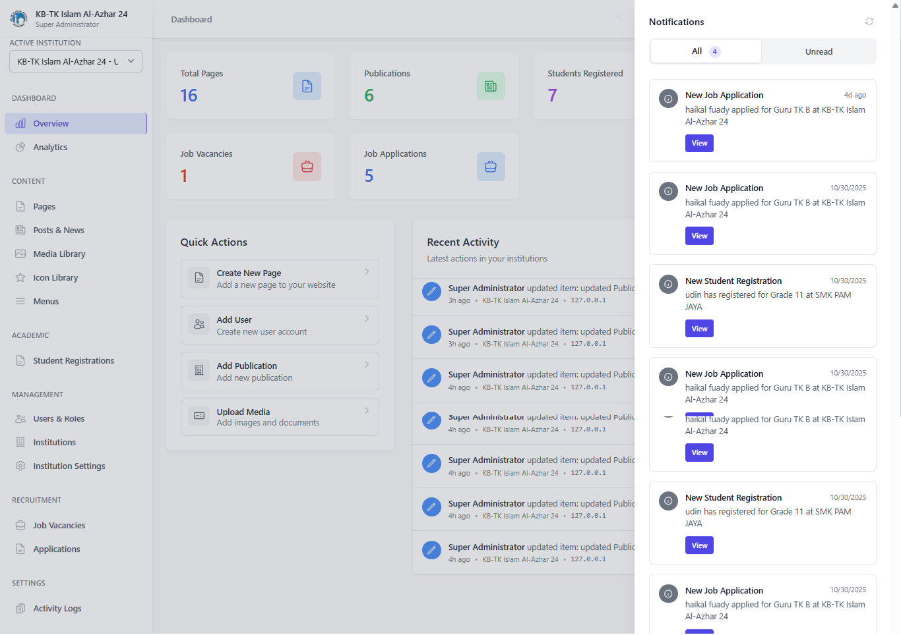
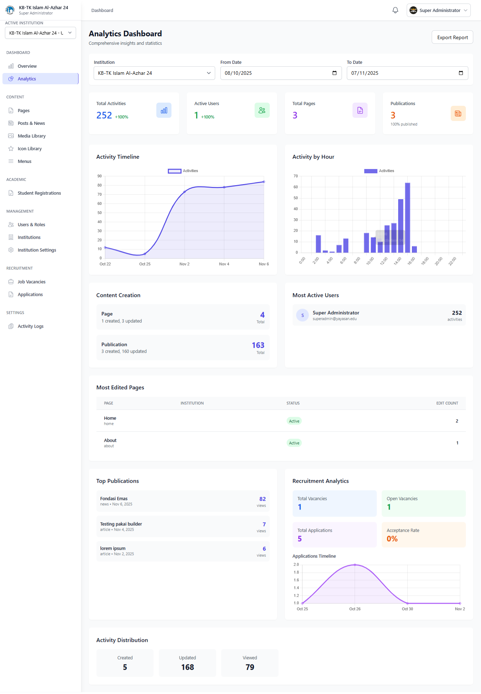
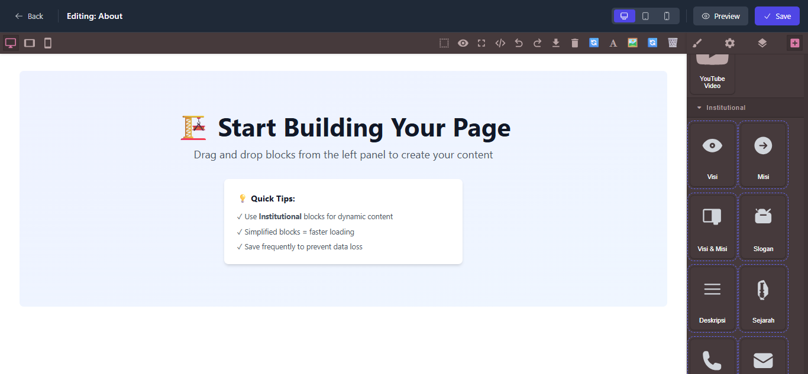
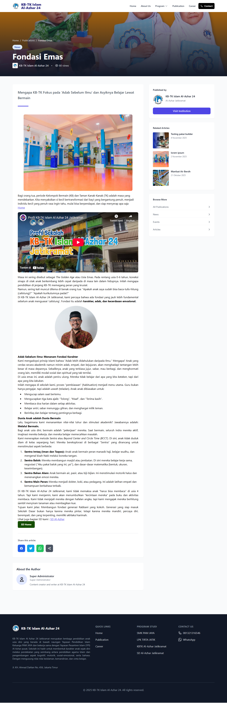
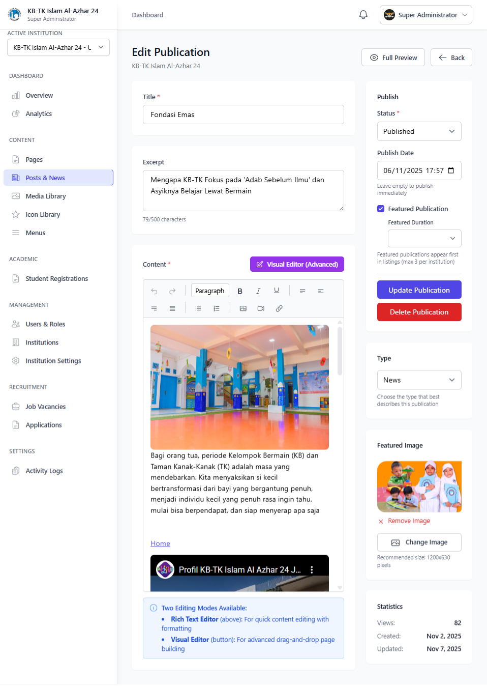
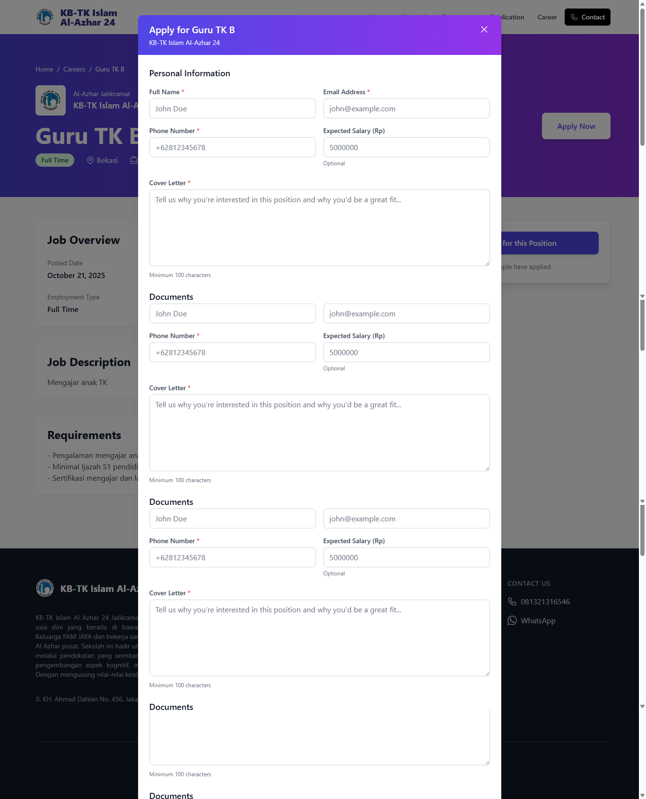
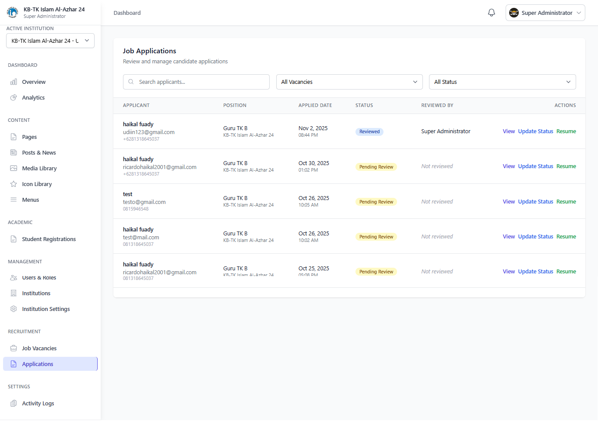

# 🏫 Yayasan Management System (YMS)

<div align="center">


**Sistem Manajemen Terpadu untuk Yayasan Pendidikan**

[Demo](#demo) • [Fitur](#-fitur-utama) • [Instalasi](docs/installation/INSTALLATION.md) • [Dokumentasi](#-dokumentasi) • [Kontribusi](#-kontribusi)

</div>

---

## 📋 Tentang Proyek

**Yayasan Management System (YMS)** adalah platform manajemen terpadu berbasis web yang dirancang khusus untuk memudahkan pengelolaan yayasan pendidikan dengan multi-institusi. Sistem ini mendukung berbagai jenis lembaga pendidikan seperti KB-TK, SD, SMP, SMA, SMK, LPK, Pesantren, hingga Koperasi di bawah satu yayasan.

### 🎯 Tujuan

-   **Efisiensi Operasional**: Mengelola seluruh institusi dari satu dashboard terpusat
-   **Transparansi**: Memberikan visibilitas penuh terhadap aktivitas dan data
-   **Skalabilitas**: Mudah dikembangkan sesuai kebutuhan yayasan
-   **User-Friendly**: Interface modern dan intuitif untuk semua level pengguna

### 👥 Target Pengguna

-   **Yayasan Multi-Institusi**: Kelola KB-TK, SD, SMP, SMA, SMK, LPK, Pesantren, Koperasi dalam satu sistem
-   **Lembaga Pendidikan**: Kelola website, konten, publikasi, dan pendaftaran siswa
-   **Administrator**: Pengelolaan user, role, permission, dan aktivitas sistem
-   **HR Team**: Manajemen rekrutmen dan lowongan pekerjaan

---

## ✨ Fitur Utama

### 🏢 Multi-Tenant & Multi-Institution

-   **Hierarki 3-Level**: Yayasan → Institusi Pusat → Unit/Cabang
-   **Multi-Website**: Setiap institusi memiliki website sendiri dengan domain/subdomain terpisah
-   **Manajemen Terpusat**: Kelola semua institusi dari satu dashboard admin
-   **Custom Branding**: Logo, warna tema, dan konten unik per institusi

### 📝 Content Management System (CMS)

-   **Visual Page Builder**: Drag-and-drop editor dengan GrapesJS untuk membuat halaman tanpa coding
-   **Rich Text Editor**: TipTap editor dengan fitur lengkap (bold, italic, heading, list, link, image, dll)
-   **Dynamic Navigation**: Kelola menu header/footer dengan drag-and-drop, support dropdown & icon
-   **Custom Templates**: Template khusus untuk homepage dan halaman spesifik (About, Contact, dll)
-   **Media Library**: Upload dan kelola gambar, dokumen dengan preview
-   **Icon Library**: Library icon SVG (Heroicons + custom) untuk digunakan di halaman dan menu

### 📰 Publikasi & Berita

-   **Multi-Type Publications**: News, Events, Articles, Blog, Announcements, Gallery
-   **Featured System**: Highlight publikasi penting (max 3 per institusi) dengan durasi otomatis
-   **Draft & Publish**: Workflow draft → review → publish dengan scheduling
-   **Rich Content**: Support gambar, video, embeds dengan visual editor
-   **SEO-Friendly**: Meta title, description, keywords, dan auto-generated slug

### 👨‍🎓 Pendaftaran Siswa Online

-   **Form Komprehensif**: Data lengkap siswa dan orang tua
-   **Upload Dokumen**: Akta kelahiran, KK, foto, raport
-   **Multi-Jenjang**: Form dinamis sesuai jenjang pendidikan (KB-TK, SD, SMP, SMA, SMK, LPK)
-   **Notifikasi Real-time**: Email & in-app notification ke admin saat ada pendaftaran baru
-   **Dashboard Pendaftaran**: Kelola dan review pendaftaran dari dashboard admin

### 💼 Rekrutmen & Karir

-   **Job Posting**: Buat lowongan dengan deskripsi lengkap, requirement, salary range
-   **Online Application**: Form lamaran dengan upload CV dan portofolio
-   **Aplikasi Tracking**: Dashboard untuk review, schedule interview, update status
-   **Email Notification**: Auto-email ke pelamar saat status berubah
-   **Multi-Status**: Pending → Reviewed → Interview → Test → Accepted/Rejected

### 👥 User & Permission Management

-   **Role-Based Access Control (RBAC)**: Kelola akses berdasarkan role
-   **Granular Permissions**: 40+ permission categories (view, create, edit, delete)
-   **Pre-defined Roles**:
    -   Super Admin: Full access ke semua tenant dan institusi
    -   Tenant Admin: Kelola semua institusi dalam satu yayasan
    -   Institution Admin: Kelola institusi tertentu
    -   Content Manager: Fokus pada konten dan publikasi
    -   Content Creator: Buat konten di semua institusi (khusus)
    -   HR Staff: Kelola rekrutmen dan job posting
    -   Teacher: Akses terbatas untuk akademik
-   **Institution Assignment**: Assign user ke multiple institusi
-   **Activity Logging**: Track semua aktivitas user (login, CRUD operations)

### 📊 Analytics & Reporting

-   **Dashboard Overview**: Statistik real-time (publikasi, users, pendaftaran, lamaran)
-   **Content Analytics**: Views, engagement, most edited pages
-   **User Analytics**: Most active users, activity by action, login patterns
-   **Recruitment Analytics**: Job vacancy stats, application conversion rates
-   **Activity Timeline**: Grafik aktivitas harian dan hourly distribution
-   **Export Reports**: Export data analytics ke JSON

### 🎨 Customization & Theming

-   **Theme Configuration**: Custom colors (primary, secondary) per institusi
-   **Logo Management**: Upload logo unik per institusi
-   **Content Blocks**: Hero section, About, Programs, Contact, Facilities
-   **Social Media Integration**: Facebook, Instagram, YouTube links
-   **Custom CSS**: Inject custom CSS untuk styling advanced

---

## 🛠️ Teknologi

### Backend

-   **Framework**: Laravel 11.x
-   **Database**: MySQL 8.0
-   **Authentication**: Laravel Sanctum
-   **Permission**: Spatie Laravel Permission
-   **Slugs**: Spatie Laravel Sluggable
-   **File Storage**: Laravel Storage (local & public disk)

### Frontend

-   **Framework**: Vue.js 3 (Composition API)
-   **Stack**: Inertia.js (SSR-like SPA)
-   **CSS**: Tailwind CSS 3.x
-   **Icons**: Heroicons + Custom SVG Library
-   **Rich Text**: TipTap Editor
-   **Page Builder**: GrapesJS
-   **Components**: Headless UI

### Developer Tools

-   **Build Tool**: Vite
-   **Package Manager**: npm/yarn
-   **Code Quality**: ESLint, Prettier (optional)

---

## 🚀 Quick Start

### Prasyarat

-   PHP 8.2+
-   Composer
-   Node.js 18+ & npm
-   MySQL 8.0+

### Instalasi Cepat

```bash
# Clone repository
git clone https://github.com/your-repo/yayasan-management-system.git
cd yayasan-management-system

# Install dependencies
composer install
npm install

# Setup environment
cp .env.example .env
php artisan key:generate

# Setup database
php artisan migrate --seed

# Build assets
npm run build

# Start server
php artisan serve
```

**Untuk panduan instalasi lengkap (termasuk untuk non-IT), silakan lihat [INSTALLATION.md](docs/installation/INSTALLATION.md)**

---

## 📸 Screenshots

<div style="background: linear-gradient(135deg, #667eea 0%, #764ba2 100%); padding: 20px; border-radius: 12px; margin-bottom: 30px;">

### 🎨 Dashboard & Analytics

<table>
  <tr>
    <td width="50%" align="center">
      <a href="docs/screenshots/dashboard.png" target="_blank">
        
      </a>
      <br><sub><b>Admin Dashboard</b></sub>
    </td>
    <td width="50%" align="center">
      <a href="docs/screenshots/analytics.png" target="_blank">
        
      </a>
      <br><sub><b>Analytics Dashboard</b></sub>
    </td>
    <!-- <td width="33%"></td> -->
  </tr>
</table>

### 📝 Content Management

<table>
  <tr>
    <td width="33%" align="center">
      <a href="docs/screenshots/page-builder.png" target="_blank">
        
      </a>
      <br><sub><b>Visual Page Builder</b></sub>
    </td>
    <td width="33%" align="center">
      <a href="docs/screenshots/publications.png" target="_blank">
        
      </a>
      <br><sub><b>Publications Management</b></sub>
    </td>
    <td width="33%" align="center">
      <a href="docs/screenshots/publications-edit.png" target="_blank">
        
      </a>
      <br><sub><b>Edit Publication</b></sub>
    </td>
  </tr>
</table>

### 🌐 Frontend Views

<table>
  <tr>
    <td width="33%" align="center">
      <a href="docs/screenshots/frontend-alazhar.png" target="_blank">
        
      </a>
      <br><sub><b>Al-Azhar Website</b></sub>
    </td>
    <td width="33%" align="center">
      <a href="docs/screenshots/frontend-ypik.png" target="_blank">
        
      </a>
      <br><sub><b>YPIK Website</b></sub>
    </td>
    <td width="33%" align="center">
      <a href="docs/screenshots/sd.png" target="_blank">
        
      </a>
      <br><sub><b>SD Website</b></sub>
    </td>
  </tr>
  <!-- <tr>
    <td width="33%" align="center">
      <a href="docs/screenshots/kbtk.png" target="_blank">
        
      </a>
      <br><sub><b>KB-TK Website</b></sub>
    </td>
    <td width="33%"></td>
    <td width="33%"></td>
  </tr> -->
</table>

### 💼 Recruitment System

<table>
  <tr>
    <td width="50%" align="center">
      <a href="docs/screenshots/job-apply-fe.png" target="_blank">
        
      </a>
      <br><sub><b>Job Application Form</b></sub>
    </td>
    <td width="50%" align="center">
      <a href="docs/screenshots/job-review.png" target="_blank">
        
      </a>
      <br><sub><b>Application Review</b></sub>
    </td>
    <!-- <td width="33%"></td> -->
  </tr>
</table>
</div>

## 💡 Tip: Klik gambar untuk melihat screenshot dalam ukuran penuh

## 🗂️ Struktur Proyek

```
yayasan-management-system/
├── app/
│   ├── Console/Commands/      # Artisan commands
│   ├── Http/Controllers/      # Controllers
│   ├── Models/                # Eloquent models
│   ├── Notifications/         # Email & notification classes
│   └── Traits/                # Reusable traits
├── database/
│   ├── migrations/            # Database migrations
│   └── seeders/               # Database seeders
├── resources/
│   ├── js/
│   │   ├── Components/        # Vue components
│   │   ├── Layouts/           # Layout components
│   │   └── Pages/             # Inertia pages
│   └── views/                 # Blade templates (for emails)
├── routes/
│   ├── web.php               # Web routes
│   └── auth.php              # Auth routes
└── public/
    └── storage/              # Public storage symlink
```

---

## 📖 Dokumentasi

### Panduan Pengguna

-   [User Guide - Admin](docs/user-guide-admin.md)
-   [User Guide - Content Creator](docs/user-guide-content.md)
-   [User Guide - HR Staff](docs/user-guide-hr.md)

### Panduan Teknis

-   [API Documentation](docs/api.md)
-   [Database Schema](docs/database-schema.md)
-   [Contributing Guide](CONTRIBUTING.md)

### Video Tutorial

-   [Installation Tutorial](https://youtube.com/...)
-   [Admin Dashboard Overview](https://youtube.com/...)
-   [Creating Pages with Visual Builder](https://youtube.com/...)

---

## 🧪 Testing

```bash
# Run all tests
php artisan test

# Run specific test suite
php artisan test --testsuite=Feature

# Run with coverage
php artisan test --coverage
```

---

## 🤝 Kontribusi

Kami sangat terbuka untuk kontribusi! Silakan lihat [CONTRIBUTING.md](CONTRIBUTING.md) untuk panduan kontribusi.

### Steps untuk Kontribusi:

1. Fork repository ini
2. Buat branch feature (`git checkout -b feature/AmazingFeature`)
3. Commit perubahan (`git commit -m 'Add some AmazingFeature'`)
4. Push ke branch (`git push origin feature/AmazingFeature`)
5. Buat Pull Request

---

## 🐛 Bug Reports & Feature Requests

Temukan bug atau punya ide fitur baru? Silakan buat [Issue](https://github.com/your-repo/issues) dengan template yang sesuai.

---

## 📄 License

Proyek ini dilisensikan under [MIT License](LICENSE).

---

## 👏 Credits

Dibuat dengan ❤️ oleh @hycallf

### Teknologi & Library yang Digunakan:

-   [Laravel](https://laravel.com)
-   [Vue.js](https://vuejs.org)
-   [Inertia.js](https://inertiajs.com)
-   [Tailwind CSS](https://tailwindcss.com)
-   [GrapesJS](https://grapesjs.com)
-   [TipTap](https://tiptap.dev)
-   [Spatie](https://spatie.be)

---

## 📞 Support

-   📧 Email: support@yms.com
-   💬 Discord: [Join our community](https://discord.gg/...)
-   📚 Documentation: [docs.yms.com](https://docs.yms.com)

---

<div align="center">

**⭐ Star proyek ini jika bermanfaat! ⭐**

Made with ☕ and 💻

</div>
